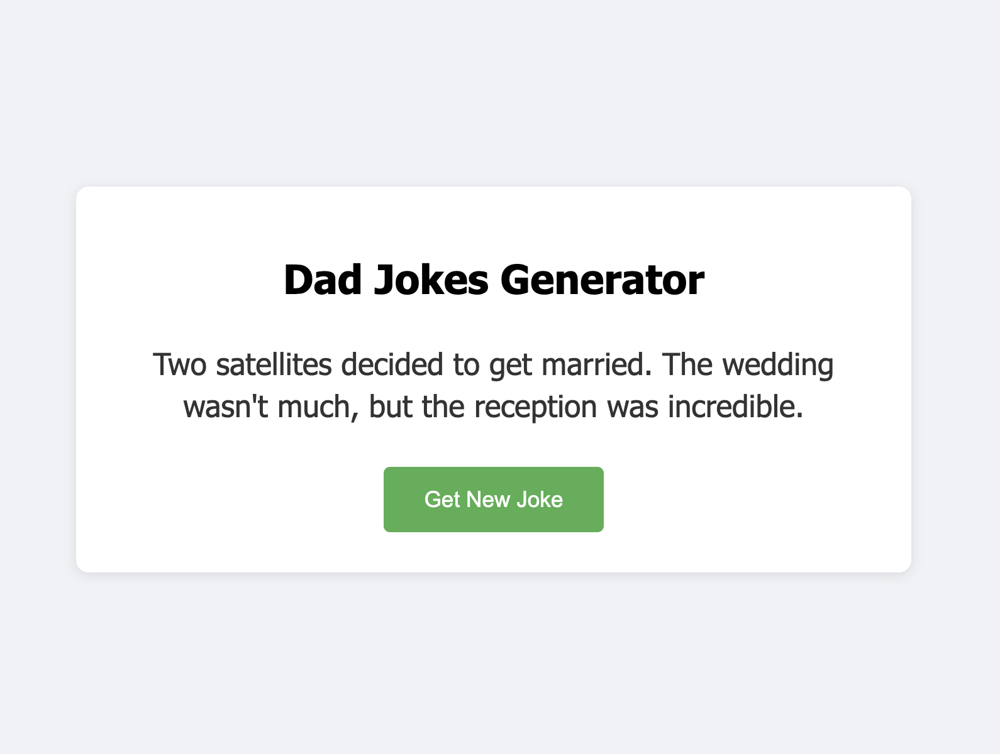

# Dad Jokes Generator

A browser-based dad jokes generator that fetches and displays jokes from the icanhazdadjoke API.

<div align="center">
  <h1>Kenjamin Button's Dad Jokes Generator</h1>

  <h3>A Modern Implementation of a Dad Jokes Web App</h3>

  <p align="center">
    <h2>
      <a href="https://dad-jokes-navy.vercel.app/" style="font-size: 24px;">
        😄 TRY LIVE DEMO 😄
      </a>
    </h2>
    <br />
    A clean and simple implementation of a dad jokes generator using HTML, CSS, and JavaScript.
    Features a modern UI design and seamless API integration.
    <br />
    <a href="https://github.com/KenjaminButton/dad-jokes"><strong>Explore the docs »</strong></a>
    <br />
    <br />
    <a href="https://github.com/KenjaminButton/dad-jokes/issues">Report Bug</a>
    ·
    <a href="https://github.com/KenjaminButton/dad-jokes/issues">Request Feature</a>
  </p>
</div>

## About The Project

A modern, web-based dad jokes generator that fetches jokes from the icanhazdadjoke API. This project features a clean, responsive design with a simple interface that makes getting your daily dose of dad jokes a breeze.

### Screenshot

<div align="center">
  
</div>

### Project Structure
```
dad-jokes/
├── index.html          # Main interface with clean HTML structure
├── styles.css          # Modern styling with responsive design
├── script.js          # Core joke fetching and display logic
└── README.md          # Project documentation
```

### Features

#### Core Functionality
* Fetch random dad jokes from icanhazdadjoke API
* Clean and modern user interface
* Loading state feedback
* Error handling
* Console logging for debugging

#### User Interface
* Responsive design
* Modern styling with subtle animations
* Clear feedback during joke loading
* Error state handling
* Simple one-click joke fetching

#### Technical Implementation
* Pure JavaScript without external dependencies
* Clean separation of concerns (HTML, CSS, JS)
* Efficient API integration
* Cross-browser compatibility
* Modern async/await implementation

### Built With

* 
* 
* 

## Getting Started

To get a local copy up and running, follow these simple steps.

### Prerequisites

* A modern web browser (Chrome, Firefox, Safari, or Edge)
* A simple HTTP server (Python's `http.server` or any alternative)

### Installation

1. Clone the repo
   ```sh
   git clone https://github.com/KenjaminButton/dad-jokes.git
   ```
2. Navigate to the project directory
   ```sh
   cd dad-jokes
   ```
3. Start a local server
   ```sh
   python3 -m http.server 8000
   ```
4. Open in your browser
   ```
   http://localhost:8000
   ```

## Code Structure

### HTML (index.html)
- Clean semantic structure
- Minimal inline attributes
- Clear commenting
- Separation of concerns

### CSS (styles.css)
- Modern design principles
- Responsive layout
- Clear state styling
- Well-documented sections

### JavaScript (script.js)
- Modern async/await syntax
- Clear error handling
- Console logging for debugging
- Event-driven architecture

## Roadmap

### Phase 1: Core Implementation 
- [x] Create basic UI layout
- [x] Implement joke fetching
- [x] Add loading states
- [x] Implement error handling
- [x] Add console logging

### Phase 2: UI Enhancement
- [ ] Add joke categories
- [ ] Implement dark mode
- [ ] Add share functionality
- [ ] Save favorite jokes
- [ ] Add animations

### Phase 3: Feature Expansion
- [ ] Multiple joke APIs
- [ ] Joke rating system
- [ ] User accounts
- [ ] Joke submission
- [ ] Social sharing

See the [open issues](https://github.com/KenjaminButton/dad-jokes/issues) for a full list of proposed features and known issues.

## Contributing

Contributions are what make the open source community such an amazing place to learn, inspire, and create. Any contributions you make are **greatly appreciated**.

1. Fork the Project
2. Create your Feature Branch (`git checkout -b feature/AmazingFeature`)
3. Commit your Changes (`git commit -m 'Add some AmazingFeature'`)
4. Push to the Branch (`git push origin feature/AmazingFeature`)
5. Open a Pull Request

## License

Distributed under the MIT License. See `LICENSE` for more information.

## Contact

Kenneth Chang - [@KenjaminButton](https://kenjaminbutton.com/contact)

Project Link: [https://github.com/KenjaminButton/dad-jokes](https://github.com/KenjaminButton/dad-jokes)

## Acknowledgments

* [icanhazdadjoke API](https://icanhazdadjoke.com/api) - for providing the jokes
* [Shields.io](https://shields.io) - for README badges
